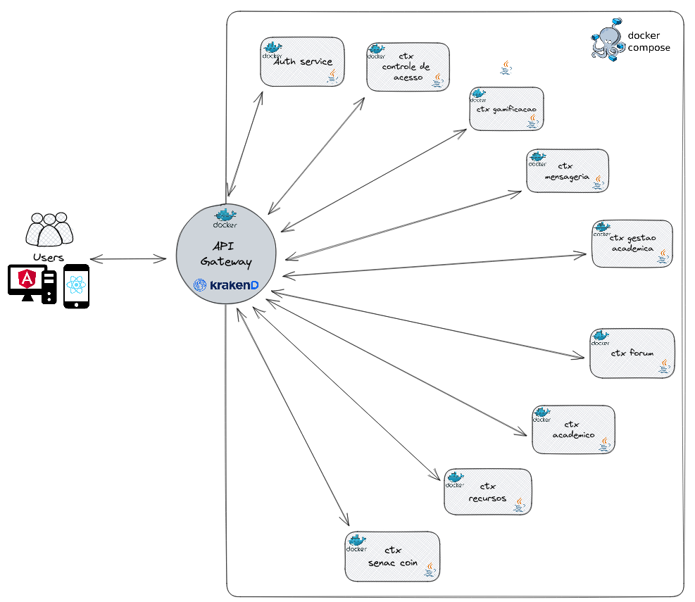

# API Gateway - Projeto Backend Java

Este projeto tem como objetivo criar um API Gateway para integrar os 7 projetos backend Java, permitindo que todas as APIs fiquem acessíveis por meio de um único ponto de entrada. O API Gateway é responsável por rotear as solicitações recebidas para os serviços apropriados.

## Funcionalidades

- Roteamento de solicitações para os serviços backend adequados
- Proteção de recursos com autenticação e autorização
- Implementação de políticas de segurança, como limitação de taxa e controle de acesso

## Endpoints

**GET /senaccoin/balance/{id}**: Retorna o saldo de senac coin de um determinado usuário

**GET /statement/{id}**: Retorna a lista de movimentações (extrato) de um determinado usuário

**POST /senaccoin**: Adiciona uma nova movimentação para um usuário

## Tecnologias utilizadas

- Java
- Angular
- [KrakenD](https://www.krakend.io/docs/overview/)
- InflluxDB
- Grafana
- Docker & docker compose
- MySQL

## Estrutura do projeto

A estrutura do projeto é a seguinte:

```bash
.
├── aprendizagem_ctx_senac_coin -> contexto grupo 7
├── aprendizagem_projeto_integrador_frontend_angular -> Frontend
├── config
│   ├── grafana
│   │   ├── dashboards
│   │   │   └── all.yml
│   │   ├── datasources
│   │   │   └── all.yml
│   │   └── krakend
│   │       └── dashboard.json
│   └── krakend
│       ├── krakend-flexible-config.tmpl
│       ├── krakend.json
│       ├── partials
│       │   ├── extra_config.tmpl
│       │   ├── input_headers.tmpl
│       │   └── rate_limit_backend.tmpl
│       ├── settings
│       │   ├── dev
│       │   │   ├── env.json
│       │   │   └── loop_example.json
│       │   └── prod
│       │       ├── env.json
│       │       └── loop_example.json
│       └── templates
│           └── sample_template.tmpl
├── docker-compose.yaml
├── Makefile
├── README.md
└── src
    └── main
        └── resources
            └── init.sql

```

## Configuração

### Requisitos

Instalar o Docker: 
- Ubuntu https://docs.docker.com/engine/install/ubuntu/ 
- Mac https://docs.docker.com/desktop/install/mac-install/ 
- Windows https://docs.docker.com/desktop/install/windows-install/

Git:
- https://git-scm.com/downloads

### Como rodar o projeto

Para configurar e executar o projeto, siga estas etapas:

1. Clone este repositório em sua máquina local com o mando `git pull --recurse-submodules`.
2. Entra na pasta criada `cd aprendizagem_projeto_integrador_full`.
3. Rode o projeto utilizando `docker compose up`.

### URLs

- **{URL}:8080/** Entrypoint do API gateway
- **{URL}:4000/** Grafana -> usuário e senha padrão admin, admin
- **{URL}:3306/** MySQL -> root password = root
- **{URL}:8090/** InfluxDB -> login e senha admin = admin; supersecretpassword
- **{URL}:808{numero_do_grupo}/** Porta, caso mapeado, para cada serviço individual

## Arquitetura da solução


